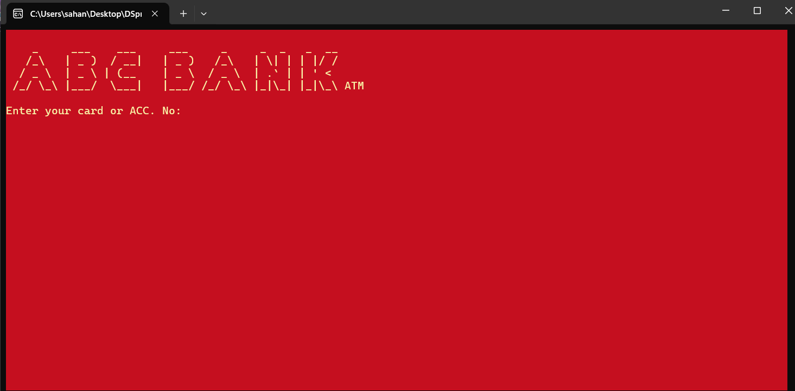

# ATM Application with Data Structures (C++)

This project is a Command Line Interface (CLI) ATM application developed during the 2nd year of university. It implements various banking operations using data structures and provides a user-friendly interface for customers to manage their accounts.

## Description

The ATM application allows users to perform the following operations:
- Deposit
- Withdraw
- Check balance
- Change PIN
- Bank transfer
- Print transaction history

## Screenshots

*Welcome Screen.*

## Usage

To use the ATM application, follow these steps:

1. Clone the repository to your local machine.
2. Run the ATM_Application.exe file.
3. Follow the prompts to perform banking operations.

## Contributing

Contributions to improve this project are welcome! You can contribute by:
- Reporting bugs or suggesting enhancements by creating issues.
- Forking the repository and submitting pull requests with your changes.

